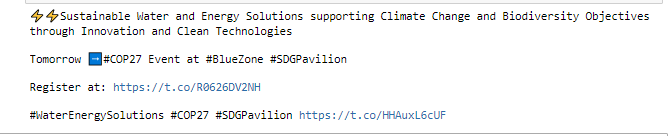
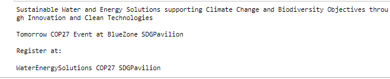
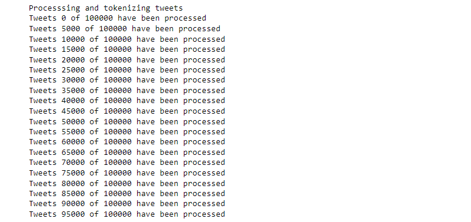
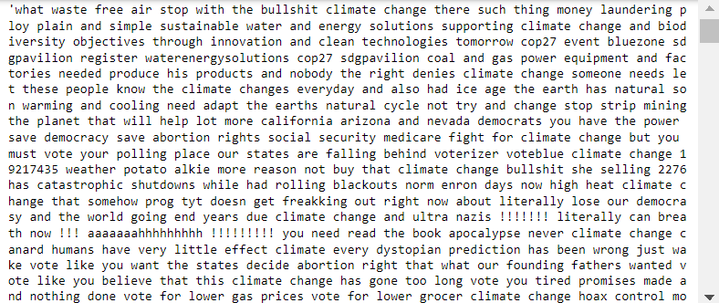
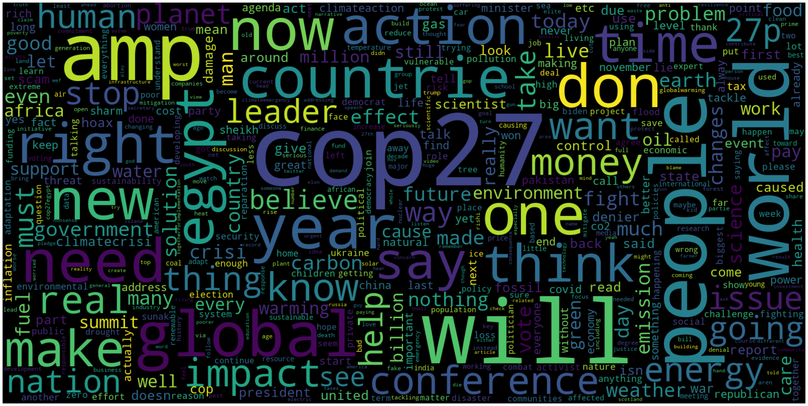
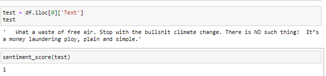
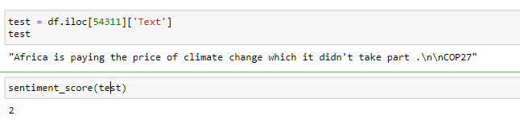

# Natural Language Processing of 100,000 Climate Change Tweets

## Introduction

With the recent midterm elections passed the controversial topic of climate change was once again being discussed in the open. Just here in California there were several propositions on the ballot relating to climate change. However, it's not always easy to understand the general public's view of climate change. Depending on what news source you follow, one can get very different impressions of the importance of climate change and society's general attitude towards the subject. 

In order to better understand the general view of climate change, I thought to look to twitter as good place to measure public sentiment of Climate Change. 


## Gathering Data

I've tried scraping tweets off of twitter in the past, but I've always run into problems of some sort. Most notably I've tried using the popular library tweepy and twitter's official api.I've overall just found these two techniques a bit limiting, as they greatly limit the amount of tweets you're able to scrape and the setup is a bit difficult. I recently discovered snscrape, and I found it to be extremely easy to use. 

Here's what the code I used to scrape tweets looked like. (Source referenced below).

```
import snscrape.modules.twitter as sntwitter
import pandas as pd

# declare variables and query
tweets_list = []
tweet_count = 100000
query = "Climate Change since:2021-01-01 until:2022-11-09" 

# use TwitterSearchScraper to scrape data and append tweets to list
for i,tweet in enumerate(sntwitter.TwitterSearchScraper(query).get_items()):
    if i>tweet_count:
        break
    tweets_list.append([tweet.date, tweet.id, tweet.content, tweet.user.username])
    
# Creating a dataframe from the tweets list above
tweets_df = pd.DataFrame(tweets_list, columns=['Datetime', 'Tweet Id', 'Text', 'Username'])
```

The query above searches twitter for the key word **"Climate Change"** and returns the specified amount of tweets. Based off of the paramaters I set, the scraper would scrape tweets from January 1, 2021 until 11:59 pm of November 8, 2022. This is helfpul as we'll be able to capture tweets from the 2022 Midterm Election. Tweets were returned in order of most recent. 


## Choosing a Data Size
Because snscrape doesn't limit the amount of tweets you can scrape, I thought it would be interesting to see just how many tweets I could scrape off of twitter. I first started by scraping 100 tweets, and I proceeded to increase the scraping quantity by a factor of ten ie. 1,000, 10,000, and so on. 

Currently, the largest amount of tweets I've scraped is 10,000. I'm currently run the script with 100,000 tweets, but it may take a very long time. My goal is to ultimately scrape 1,000,000 tweets, but I'm not sure my computer will be able to execute it.

Ultimately, I decided to go with 100,000 tweets because I was able to execute it and I think this wil be more than enough to get an accurate understanding of the sentiment on twitter .


## Data Processing

After scraping 100,000 tweets with the keyword **"Climate Change"**, this is what my data set looks like. The features include:
- **Datetime** (The exact timestamp the tweet was posted)
- **Tweet Id** (A unique identification number for a specific tweet)
- **Text** (The text of the tweet)
- **Username** (The official twitter username that posted the tweet)


As we can see above the dataframe contains 100,001 rows and 4 columsn, thus we've succesfully scraped over 100,000 tweets. 

However, because these strings were taken off of twitter, they contain emojis, urls and other types of data that will most likely affect the efficacy of our analysis. 

Because the tweets are a string type, I decided that the easiest way to accomplish what I wanted would be to use regular expressions. I managed to write this function below with the help of some documentation which removes emojis, @mentions, hashtags, and urls. 


```
def clean_string(a):
    
    # remove emoji's
    emoji_pattern = re.compile("["
                           u"\U0001F600-\U0001F64F"  # emoticons
                           u"\U0001F300-\U0001F5FF"  # symbols & pictographs
                           u"\U0001F680-\U0001F6FF"  # transport & map symbols
                           u"\U0001F1E0-\U0001F1FF"  # flags (iOS)
                           u"\U00002702-\U000027B0"
                           u"\U000024C2-\U0001F251"
                           "]+", flags=re.UNICODE)
    a = emoji_pattern.sub(r'', a)

    # remove @ symbols and hashtags
    re_list = ['@[A-Za-z0–9_]+', '#']
    combined_re = re.compile( '|'.join( re_list) )
    a = re.sub(combined_re,'',a)

    # remove urls from text
    pattern = re.compile(r'(https?://)?(www\.)?(\w+\.)?(\w+)(\.\w+)(/.+)?')
    a = re.sub(pattern,'',a)
    output = a
    return output

```

**String before processing**



**After processing string**



As we can see the string is being processed correctly, and we've successfully removed the undesirable elements. 

Now I needed to run this function on all 100,000 tweets in the dataset. I did this via a single for loop. The time complexity of the function call is O(N), and I don't think there's a more efficient way to call the function. 

```
for i in range(100001):
    df['Text'][i] = clean_string(df.iloc[i]['Text'])
```

Due to the size of this data, one thing that I'm worried about is run time, but the function only took about two minutes to fully run all 100,000 iterations. 

## Exploratory Data Analysis

Now that we've removed undesirable text elements from our data we can begin to explore the data from our data. 

I'd like to find the most common words in the data to understand what words are most frequently associated with "Climate Change" on twitter. 

Before doing so, we need to do a little bit more processing on the text data. We will use  **WordPunctTokenizer** from the **nltk** libary to tokenize each tweet. Tokenization is simply the process of separating a text string into individual words. We will then convert each word to lower case and save the words in one large string. 

We can accomplish this data processing with the code below. 

```
from nltk.tokenize import WordPunctTokenizer
tk = WordPunctTokenizer()

def tokenize_and_process(d):
    
    d = str(d)
    lower_case = d.lower()
    words = tk.tokenize(lower_case)
    result_words = [x for x in words if len(x) > 2]
    return (" ".join(result_words)).strip()

```
Now we will run this function on all 100,000 tweets in our data set. 


```
processed_tweets = []
print ('Processsing and tokenizing tweets')
for i in range(100000):
    if i % 5000 == 0:
        print("Tweets {} of {} have been processed".format(i, 100000))
    processed_tweets.append(tokenize_and_process(df.Text[i]))
```



**As we can see we've successfully processed 100,000 of our tweets**

Next we will save all of our processed tweets into one giant string. 

```
string = pd.Series(processed_tweets).str.cat(sep=' ')
```
**Our output string**



### Generating Word Cloud

Now we will generate a word cloud based on the string we've created above. 

Before generating the word cloud. We need to filter out Stop Words. Stop words are words in Natural Language Processing which we deem will not provide us with any semantic insight. 

The wordcloud module STOPWORDS comes with a preset list of stop words. We will also add in a few additional stop words to filter out unneccesary climate change related words. 

```
from wordcloud import STOPWORDS
stopwords = set(STOPWORDS)
custom_stopwords = ['climate', 'climate change', 'change', 'climatechange']
stopwords.update(custom_stopwords)
```

Now that we've accounted for stop words we can generate a word cloud with 200 most common words from our 100,000 scraped tweets

```
from wordcloud import WordCloud
import matplotlib.pyplot as plt

wordcloud = WordCloud(width=1600, stopwords=stopwords,height=800,max_font_size=200,max_words=500,collocations=False, background_color='black').generate(string)
plt.figure(figsize=(40,30))
plt.imshow(wordcloud, interpolation="bilinear")
plt.axis("off")
plt.show()
```


### 200 MOST COMMON WORDS FROM 100,000 CLIMATE CHANGE TWEETS


## Tweet Classification with Bidirectional Encoder Representations from Transformers (BERT)

BERT is an open source machine learning framework developed by Google in 2018 used for advanced Natural Language Processing tasks. The model was developed by Jacob Devlin and other Google employees and was trained on English Wikipedia (2,500M words) and BookCorpus (800M words). The key differentiator in the BERT model is its Bidirectionality or rather nondirectionality. Rather than reading sentences right to left, the model is able to read sentences all at once. I won't get too deep into the workings of BERT but more can be read about it here. 

I am aware that **Open AI's GPT3** performs better than BERT at text classification, but due to limited access I decided to use BERT for this classification project. 

### Implementation of BERT Base Model
```
# Import necessary libraries
from transformers import AutoTokenizer, AutoModelForSequenceClassification
import torch
import requests
import re

# Instantiate Model
tokenizer = AutoTokenizer.from_pretrained('nlptown/bert-base-multilingual-uncased-sentiment')

model = AutoModelForSequenceClassification.from_pretrained('nlptown/bert-base-multilingual-uncased-sentiment')
```

Next let's create a function to use the model to predict sentiment. 

```
def sentiment_score(tweet):
    tweet = str(tweet)
    tokens = tokenizer.encode(tweet, return_tensors='pt')
    result = model(tokens)
    return int(torch.argmax(result.logits))+1

```

**In this case:**
- **1 is very negative**
- **2 is negative**
- **3 is neutral**
- **5 is very positive**

Lets test our function. 





**Testing function
## Further ideas

- plot histogram of the responses and overlay with the 'predicted ideas of twitter political skew'

## References

1. https://medium.com/dataseries/how-to-scrape-millions-of-tweets-using-snscrape-195ee3594721

2. https://pypi.org/project/snscrape/

3. https://medium.com/codex/making-wordcloud-of-tweets-using-python-ca114b7a4ef4

4. https://gist.github.com/slowkow/7a7f61f495e3dbb7e3d767f97bd7304b#file-remove-emoji-py-L28

5. https://www.wikiwand.com/en/Stop_words

6. https://towardsdatascience.com/sentiment-analysis-in-10-minutes-with-bert-and-hugging-face-294e8a04b671

7. https://github.com/SpencerPao/Natural-Language-Processing/blob/main/BERT/BERT_Code_Implementation.ipynb


