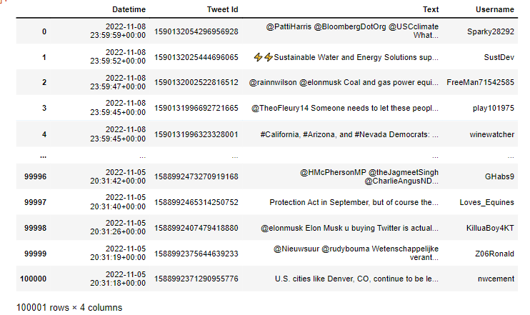

# Natural Language Processing of Climate Change Tweets

## Introduction

With the recent midterm elections passed the controversial topic of climate change was once again being discussed in the open. Just here in California there were several propositions on the ballot relating to climate change. However, it's not always easy to understand the general public's view of climate change. Depending on what news source you follow, one can get very different impressions of the importance of climate change and society's general attitude towards the subject. 

In order to better understand the general view of climate change, I thought to look to twitter as good place to measure public sentiment of Climate Change. 


## Gathering Data

I've tried scraping tweets off of twitter in the past, but I've always run into problems of some sort. Most notably I've tried using the popular library tweepy and twitter's official api.I've overall just found these two techniques a bit limiting, as they greatly limit the amount of tweets you're able to scrape and the setup is a bit difficult. I recently discovered snscrape, and I found it to be extremely easy to use. 

Here's what the code I used to scrape tweets looked like. (Source referenced below).

```
import snscrape.modules.twitter as sntwitter
import pandas as pd

# declare variables and query
tweets_list = []
tweet_count = 100000
query = "Climate Change since:2021-01-01 until:2022-11-09" 

# use TwitterSearchScraper to scrape data and append tweets to list
for i,tweet in enumerate(sntwitter.TwitterSearchScraper(query).get_items()):
    if i>tweet_count:
        break
    tweets_list.append([tweet.date, tweet.id, tweet.content, tweet.user.username])
    
# Creating a dataframe from the tweets list above
tweets_df = pd.DataFrame(tweets_list, columns=['Datetime', 'Tweet Id', 'Text', 'Username'])
```

The query above searches twitter for the key word **"Climate Change"** and returns the specified amount of tweets. Based off of the paramaters I set, the scraper would scrape tweets from January 1, 2021 until 11:59 pm of November 8, 2022. This is helfpul as we'll be able to capture tweets from the 2022 Midterm Election. Tweets were returned in order of most recent. 


## Choosing a Data Size
Because snscrape doesn't limit the amount of tweets you can scrape, I thought it would be interesting to see just how many tweets I could scrape off of twitter. I first started by scraping 100 tweets, and I proceeded to increase the scraping quantity by a factor of ten ie. 1,000, 10,000, and so on. 

Currently, the largest amount of tweets I've scraped is 10,000. I'm currently run the script with 100,000 tweets, but it may take a very long time. My goal is to ultimately scrape 1,000,000 tweets, but I'm not sure my computer will be able to execute it.

Ultimately, I decided to go with 100,000 tweets because I was able to execute it and I think this wil be more than enough to get an accurate understanding of the sentiment on twitter .


## Data Processing

After scraping 100,000 tweets with the keyword **"Climate Change"**, this is what my data set looks like. The features include:
- **Datetime** (The exact timestamp the tweet was posted)
- **Tweet Id** (A unique identification number for a specific tweet)
- **Text** (The text of the tweet)
- **Username** (The official twitter username that posted the tweet)



As we can see above the dataframe contains 100,001 rows and 4 columsn, thus we've succesfully scraped over 100,000 tweets. 

However, because these strings were taken off of twitter, they contain emojis, urls and other types of data that will most likely affect the efficacy of our analysis. 

Because the tweets are a string type, I decided that the easiest way to accomplish what I wanted would be to use regular expressions. I managed to write this function below with the help of some documentation which removes emojis, @mentions, hashtags, and urls. 


```
def clean_string(a):
    
    # remove emoji's
    emoji_pattern = re.compile("["
                           u"\U0001F600-\U0001F64F"  # emoticons
                           u"\U0001F300-\U0001F5FF"  # symbols & pictographs
                           u"\U0001F680-\U0001F6FF"  # transport & map symbols
                           u"\U0001F1E0-\U0001F1FF"  # flags (iOS)
                           u"\U00002702-\U000027B0"
                           u"\U000024C2-\U0001F251"
                           "]+", flags=re.UNICODE)
    a = emoji_pattern.sub(r'', a)

    # remove @ symbols and hashtags
    re_list = ['@[A-Za-z0–9_]+', '#']
    combined_re = re.compile( '|'.join( re_list) )
    a = re.sub(combined_re,'',a)

    
    # remove urls from text
    pattern = re.compile(r'(https?://)?(www\.)?(\w+\.)?(\w+)(\.\w+)(/.+)?')
    a = re.sub(pattern,'',a)
    print(a)

```

**Removing Emojis**

**Removing urls**

**Removing @mentions and hashtags**


## Exploratory Data Analysis


## References

1. https://medium.com/dataseries/how-to-scrape-millions-of-tweets-using-snscrape-195ee3594721

2. https://pypi.org/project/snscrape/

3. https://medium.com/codex/making-wordcloud-of-tweets-using-python-ca114b7a4ef4

4. https://gist.github.com/slowkow/7a7f61f495e3dbb7e3d767f97bd7304b#file-remove-emoji-py-L28

5. 