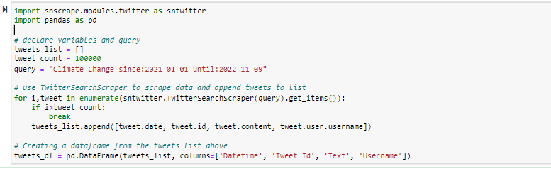

# Natural Language Processing of Climate Change Tweets

## Introduction

With the recent midterm elections passed the controversial topic of climate change was once again being discussed in the open. Just here in California there were several propositions on the ballot relating to climate change. However, it's not always easy to understand the general public's view of climate change. Depending on what news source you follow, one can get very different impressions of the importance of climate change and society's general attitude towards the subject. 

In order to better understand the general view of climate change, I thought to look to twitter as good place to measure public sentiment of Climate Change. 

## Gathering Data

I've tried scraping tweets off of twitter in the past, but I've always run into problems of some sort. Most notably I've tried using the popular library tweepy and twitter's official api.I've overall just found these two techniques a bit limiting, as they greatly limit the amount of tweets you're able to scrape and the setup is a bit difficult. I recently discovered snscrape, and I found it to be extremely easy to use. 

Here's what the code I used to scrape tweets looked like. (Source referenced below.)

## References

1. https://medium.com/dataseries/how-to-scrape-millions-of-tweets-using-snscrape-195ee3594721

2. 